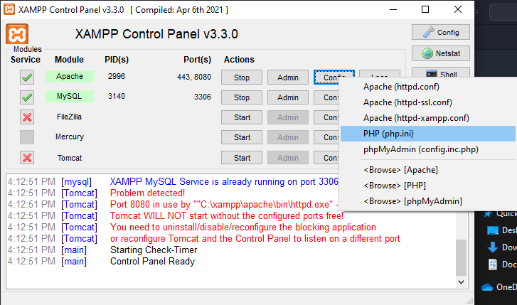
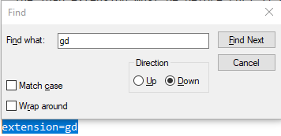

# Clothes Store application description

## 1. How to run

- Clone repo

- Run "composer update" command in terminal of file directory

- Use database.sql to re-create the database for the project.

- Add .env file containing the configuration which can be found [HERE](https://drive.google.com/file/d/1HbktvUbadsGQMP8_pPJe6rC4jthWENpu/view?usp=sharing)

- Make sure to have the GD library enabled in the hosting devices, to do that for XAMPP as follows:

  + Open php.ini in Apache config from XAMPP control panel
  <p align="center">
    
  </p>

  + Search for "gd" and remove ";" in front of the line

  <p align="center">
    
  </p>

- Run "php artisan serve"" in terminal of file directory

- Access "localhost:8000" from browser and the application should be running

## 2. System access

To login as admin, go to "/loginAdmin" and use
```
{
    "username": "admin",
    "password": "admin"
}
```

To login as customer, go to "/customerLogin" and use
```
{
    "username": "customer",
    "password": "customer"
}
```
or use sign in with Google option to create an account.