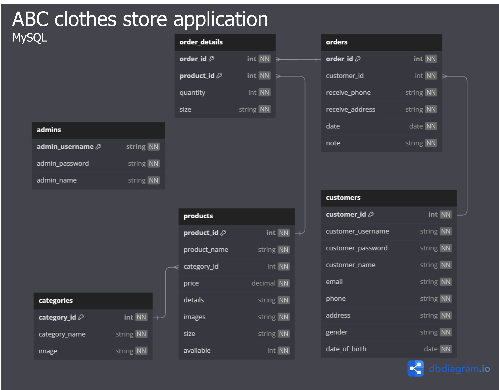

# Clothes Store application description

## 1. How to run

- Clone repo

- Run "composer update" command in terminal of file directory

- Use database.sql to re-create the database for the project.

- Add .env file containing the configuration which can be found [HERE](https://drive.google.com/file/d/1HbktvUbadsGQMP8_pPJe6rC4jthWENpu/view?usp=sharing)

- Make sure to have the GD library enabled in the hosting devices, to do that for XAMPP as follows:

  + Open php.ini in Apache config from XAMPP control panel
  <p align="center">
    
  </p>

  + Search for "gd" and remove ";" in front of the line

  <p align="center">
    
  </p>

- Run "php artisan serve"" in terminal of file directory

- Access "localhost:8000" from browser and the application should be running

## 2. System access

To login as admin, go to "/loginAdmin" and use
```
{
    "username": "admin",
    "password": "admin"
}
```

To login as customer, go to "/customerLogin" and use
```
{
    "username": "customer",
    "password": "customer"
}
```
or use sign in with Google option to create an account.

## 3. Database design

For this project, we used MySQL hosted on XAMPP to store our data. The design of the database is as follow.

<p align="center">
  
</p>

## 4. Technologies

- The application was developed in Microsoft Visual Code due to its lightweight feature and how easy it is to get started

- We used PHP language and Laravel framework to create the application thanks to flexibility and ease of implementation

- The version control system (VCS) was GitHub to store and share our code between the members of the team because we were familiar with this technology from previous projects.

- The database for this application was MySQL which will be hosted locally through XAMPP to facilitate hosting project on localhost

#### More information on how we planned and implemented this application as well as difficulties we faced can be found [HERE](https://drive.google.com/file/d/1yKHo5hseKr03QTK7N724MF-8FVyzJUXj/view?usp=sharing)